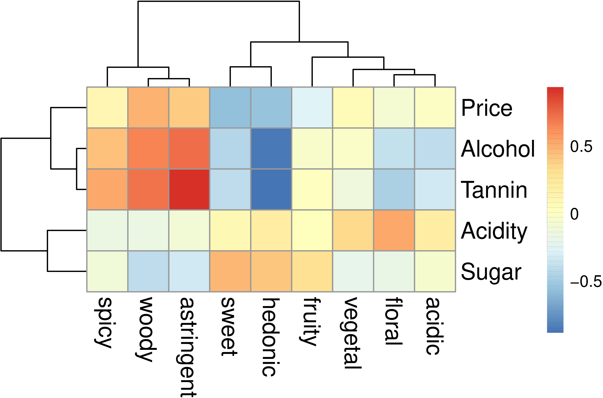

# Wine data set

We illustrate CCA on a wine tasting data set.

These data describe thirty-six 
red, rosé, or white wines
produced in three different countries
(Chili, Canada, and USA) using several different varietal of grapes.
These wines are described by two different sets of variables.
The first set of variables (i.e., matrix X) 
describes the objective properties of the wines:
Price, Acidity, Alcohol content, Sugar, and Tannin
(in what follows we capitalize these descriptors).
The second set of variables (i.e., matrix Y) 
describes the subjective properties of the wines as evaluated
by a professional wine taster and consists in ratings
on a 9-point rating scale of 8 aspects of taste:
fruity, floral, vegetal, spicy, woody, sweet, astringent, acidic,     
plus an overall evaluation of the hedonic aspect of the wine 
(i.e., how much the taster liked the wine).

As shown in the following Figure (for matrix R), the objective variables Alcohol and Tannin 
are positively correlated with the perceived qualities of astringent and
woody; by contrast, the perceived hedonic aspect of wine is negatively   
correlated with Alcohol, Tannin 
(and Price, so our taster liked inexpensive wines\dots) 
and positively correlated with the Sugar content of the wines. 
Unsurprisingly, the objective amount of Sugar is correlated with the 
perceived quality sweet.

