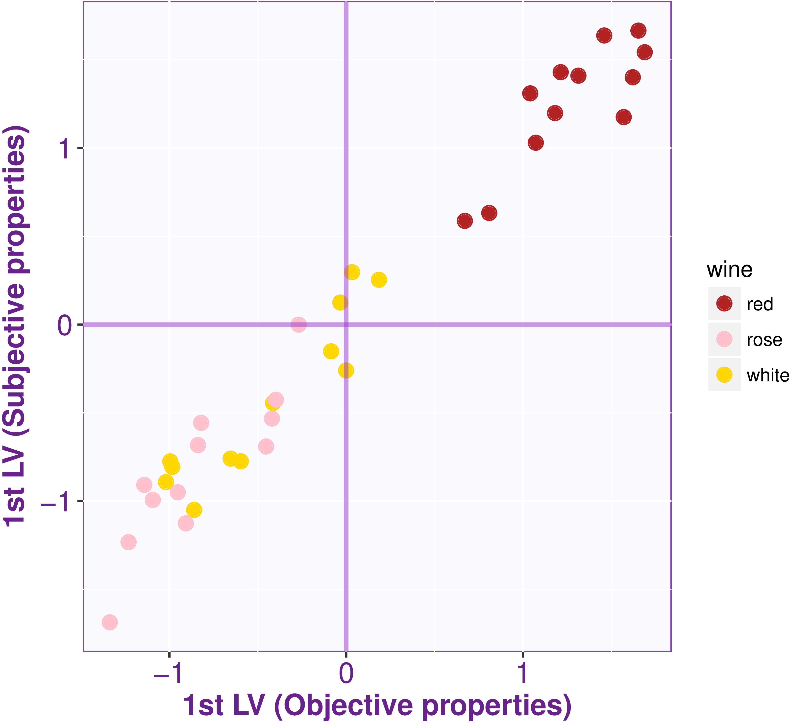

# Latent variables

The CCA 
of these data
found 5 pairs of latent variables (in general, CCA will find a maximum 
of
$$\min(I,J)$$ pairs of latent variables). 
The first and second canonical correlations are very high ($$.98$$ and $$.85$$),
and so we will only consider them here.
As shown in the Figure below,
the latent variables extracted by the analysis are very sensitive to
the ``color'' of the wines: 
The first pair of latent variables isolates the red wines.

