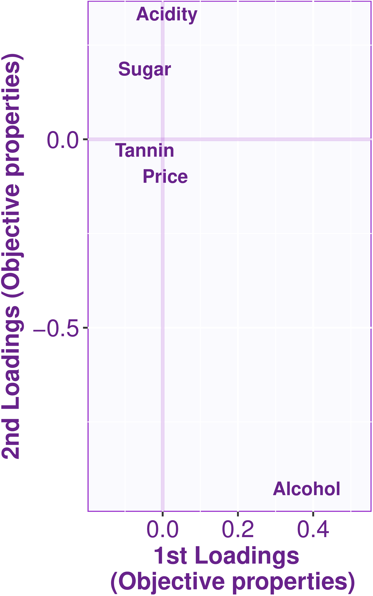

# Loadings

\\(\DeclareMathOperator{\cor}{cor}\\)
\\(\newcommand{\matrice}[1]{\mathbf{#1}}\\)
\\(\newcommand{\X}{\matrice{X}}\\)
\\(\newcommand{\Y}{\matrice{Y}}\\)
\\(\newcommand{\P}{\matrice{P}}\\)
\\(\newcommand{\Q}{\matrice{Q}}\\)
\\(\newcommand{\p}{\matrice{p}}\\)
\\(\newcommand{\q}{\matrice{q}}\\)

The following Figure displays
the loadings  for, respectively, \\( \X \\) and \\(\Y\\) 
(i.e., matrices \\(\P\\) and \\(\Q\\)) for the first two dimensions
of the analysis. 

