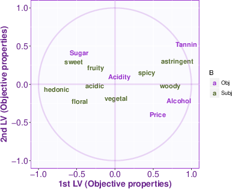

# Correlation circles

Figure \ref{fig:corcircle1} (respectively \ref{fig:corcircle2})
shows the correlation between the original variables 
(both $\X$ and $\Y$) and respectively $\F$ (i.e., the latent variables from $\X$)
and  $\G$ (i.e., the latent variables from $\Y$).

